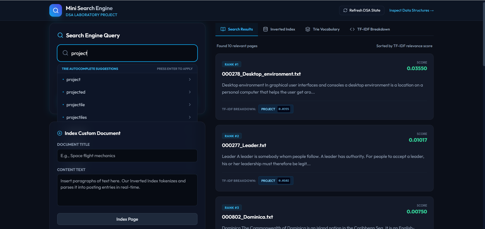

# 🔍 Mini Search Engine

A high-performance **C++ Search Engine** built from scratch for efficient document retrieval over a large-scale Wikipedia corpus. The project uses classic Information Retrieval techniques including **Inverted Index**, **Trie**, **BM25 Ranking**, **Spell Correction**, **Multi-word Search**, and **LRU Cache** to provide fast and relevant search results.

---

## ✨ Features

- 📄 Automatic Wikipedia dataset conversion into searchable documents
- 🔎 Single-word and Multi-word Search
- 📊 BM25 based document ranking
- 🌳 Trie-based autocomplete and prefix search
- ✍️ Spell Correction (Edit Distance ≤ 2)
- 💡 Query Recommendations
- ⚡ LRU Cache for frequently searched queries
- 📁 Automatic indexing of thousands of documents
- 🚀 Average Query Time: **1–2 ms**
- ⏱ Index Construction Time: **~7 seconds**

---

## 🏗 Project Architecture

```
Wikipedia Dataset
        │
        ▼
Dataset Converter
        │
        ▼
Documents Folder
        │
        ▼
Tokenizer
        │
        ▼
Inverted Index + Trie
        │
        ▼
BM25 Ranking
        │
        ▼
Search Engine
        │
        ▼
React Frontend
```

---

## 🧠 Data Structures Used

- Inverted Index
- Trie
- Hash Map
- Vector
- Queue
- LRU Cache
- Filesystem

---

## ⚙ Algorithms Used

- BM25 Ranking
- Edit Distance (Levenshtein Distance)
- Boolean Search
- Multi-word Search
- Prefix Search
- Tokenization

---

## 🛠 Tech Stack

- **Language:** C++17
- **Frontend:** React + Vite
- **Libraries:** STL, Filesystem
- **Dataset:** Simple English Wikipedia

---

## 📊 BM25 Ranking

Search results are ranked using the **BM25 (Best Matching 25)** algorithm, a probabilistic ranking function widely used in modern search engines.

BM25 considers:

- **Term Frequency (TF):** How often a query term appears in a document.
- **Inverse Document Frequency (IDF):** Gives higher importance to terms that are rare across the document collection.
- **Document Length Normalization:** Prevents very long documents from receiving unfairly high scores.
- **Term Frequency Saturation:** Repeated occurrences of a term provide diminishing returns instead of increasing relevance linearly.

The BM25 score is computed as:

```math
{Score} = IDF × \left( \frac{\text{TF × (k1 + 1)}}{\text{TF + k1 × (1 - b + b × (DL / AvgDL))}} \right)
```

```math
{IDF} = \log \left( 1 + \frac{\text{N - DF + 0.5}}{\text{DF + 0.5}} \right)
```

where:

| Symbol | Description |
|--------|-------------|
| **TF** | Frequency of query term *q* in document *D* |
| **IDF** | Inverse Document Frequency of term *q* |
| **DL** | Number of words in the document |
| **AvgDL** | Average document length across the corpus |
| **k1** | Controls term-frequency saturation (typically **1.2–2.0**) |
| **b** | Controls document length normalization (typically **0.75**) |
| **N** | The number of total Documents |
| **DF** | The number of document containing this word |

### BM25 Parameters Used

```cpp
k1 = 1.5
b  = 0.75
```

These values provide a good balance between term frequency and document length normalization and are commonly used in information retrieval systems.

---

## 📂 Project Structure

```
MiniSearchEngine/
│
├── backend/
│   ├── engine.cpp
│   ├── engine.hpp
│   └── ...
│
├── documents/
│   └── Generated Wikipedia Articles
│   └── ...
|
├── frontend/
│   └── React Application
│   └── package.json
|   └── postcss.config.js
|   └── tailwind.config.js
|   └── vite.config.js
|
└── README.md
```

---

## 🚀 Performance

| Metric | Value |
|--------|-------|
| Indexed Documents | 1,000+ |
| Index Build Time | ~7 s |
| Average Search Time | 1–2 ms |
| Spell Suggestion Time | ~100 ms |
| Ranking Algorithm | BM25 |
| Spell Correction | Edit Distance ≤ 2 |

---

## 📸 Screenshots

<h2 align="center">Home Page</h2>

<p align="center">
  
</p>
---

<h2 align="center">Search Results</h2>

<p align="center">
  
</p>

---

<h2 align="center">Spell Correction</h2>

<p align="center">
  
</p>

---

## 💻 Getting Started

### Clone Repository

```bash
git clone https://github.com/KrIsH-1206/Mini-Search-Engine.git
cd Mini-Search-Engine
```

### Backend

```bash
mkdir build
cd build
cmake ..
make
```

### Frontend

```bash
cd frontend
npm install
npm run dev
```

---

## 🎯 Future Improvements

- BM25 Ranking
- Persistent Index Storage
- Fuzzy Search
- Search Analytics
- Parallel Index Construction
- Advanced Query Parsing

---

## 👨‍💻 Author

**Krish Vamja**
